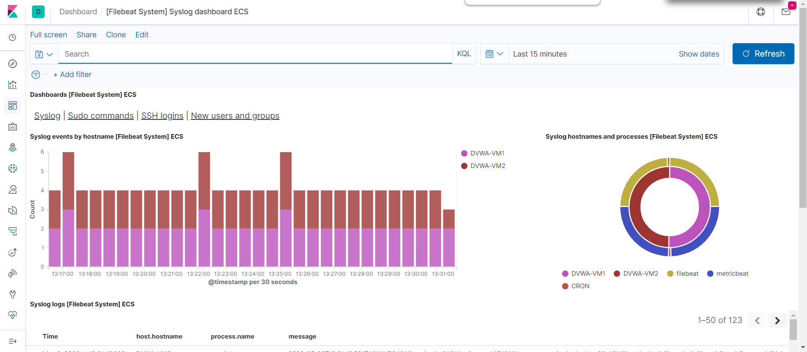
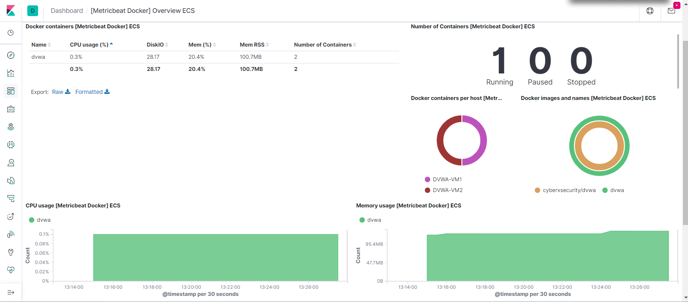

## Automated ELK Stack Deployment

The files in this repository were used to configure the network depicted below.

These files have been tested and used to generate a live ELK deployment on Azure. They can be used to either recreate the entire deployment pictured above. Alternatively, select portions of the .yml file may be used to install only certain pieces of it, such as Filebeat.

 - [pentest.yml](pentest.yml)
 - [elk-playbook.yml](elk-playbook.yml)
 - [Filebeat-Metricbeat.yml](Filebeat-Metricbeat.yml)

These documents contain the following details:
- Description of the Topology
- Access Policies
- ELK Configuration
  - Beats in Use
  - Machines Being Monitored
- How to Use the Ansible Build

### Description of the Topology

The main purpose of this network is to expose a load-balanced and monitored instance of DVWA, the D*mn Vulnerable Web Application.

Load balancing ensures that the application will be highly accessable, in addition to restricting access to the network.
The Load blancer helps ensures a backup in the case of a flaw or missing coverage. 
A secure jump box ensures remote access for system administrators. 
It supplies continual support and is a reasonable solution when some of your users either have no direct office or data center access.

Integrating an ELK server allows users to easily monitor the vulnerable VMs for changes to the system and system logs.
Filebeat monitors the log files or locations that you specify, collects log events, and forwards them either to Elasticsearch or Logstash for indexing
Metricbeat records standard cpu/mem/disk/network metrics, and can also monitor Apache, Docker, Nginx, Redis, etc.

The configuration details of each machine may be found below.

| Name     | Function   | IP Address | Operating System |
|----------|------------|------------|------------------|
| Jump Box | Gateway    | 10.0.0.5   | Linux            |
| DVWA-VM1 | Web Host   | 10.0.0.8   | Linux            |
| DVWA-VM2 | Web Host   | 10.0.0.9   | Linux            |
| Elk-Box  | Elk Server | 10.0.0.12  | Linux            |

### Access Policies

The machines on the internal network are not exposed to the public Internet. 

Only the Ansible machine can accept connections from the Internet. Access to this machine is only allowed from the following IP addresses:
Whitelisted IP addresses: 10.0.0.8, 10.0.0.9, Personal IP

Machines within the network can only be accessed by SSH.
Only DVWA-VM1 and DVWA-VM2 are allowed to access The Elk-Box. Elk-Box IP: 13.93.205.115

A summary of the access policies in place can be found in the table below.

| Name     | Publicly Accessible | Allowed IP Addresses |
|----------|---------------------|----------------------|
| Jump Box | No                  | 10.0.0.5             |
| DVWA-VM1 | Yes                 | Any                  |
| DVWA-VM2 | Yes                 | Any                  |
| Elk-Box  | No                  | Personal IP-Address  |

### Elk Configuration

Ansible was used to automate configuration of the ELK machine. No configuration was performed manually, which is advantageous because...
it can be set up in minutes using OpenSSH without installing anything on the servers

The playbook implements the following tasks:
- Install Docker
- Install Python-pip
- Install Docker python module
- Optimize Memory
- Download and launch a docker web container

The following screenshot displays the result of running `docker ps` after successfully configuring the ELK instance.

### Target Machines & Beats
This ELK server is configured to monitor the following machines:
- 10.0.0.8
- 10.0.0.9

We have installed the following Beats on these machines:
- Filebeat
- Metricbeat

These Beats allow us to collect the following information from each machine:
- Filebeat: Monitors the log files or locations that you specify, collects log events, and forwards them either to Elasticsearch or Logstash for indexing.

- Metricbeat: Collects metrics from the operating system and from services running on the server.

### Using the Playbook
In order to use the playbook, you will need to have an Ansible control node already configured. Assuming you have such a control node provisioned: 

SSH into the control node and follow the steps below:
- Copy the playbook file to your control node in "/etc/ansible".
- Update the hosts file to include elk server IP-addess.
- Run the playbook, and navigate to http://[elk-server Puplic IP]:5601/ to check that the installation worked as expected.
 
